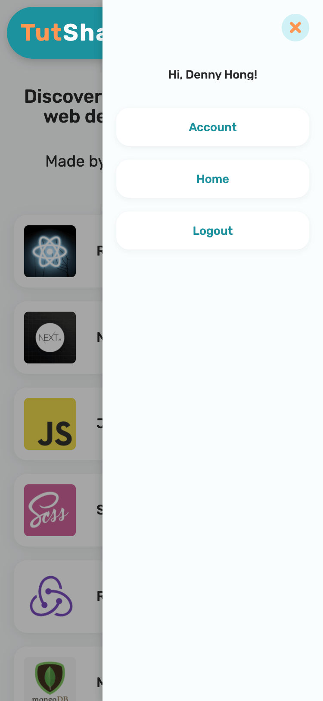

# TutShare

### An online platform for sharing web devleopment study resources.

#### Built with React, Next.js, Redux, Sass, Nodejs, MongoDB, AWS (S3, EC2, SES)

## User stories:

#### As a user, I can:

- See trending resources.
- Browse study resources by category.
- Register / Sign in to share resources.
- Update / Delete resources I shared.
- Set categories as my interests.
- Get email notifications when new reources are shared that fits my interests.
- Use TutShare platform on all devices regardless of screen sizes.

#### As an admin, I can:

- Create new categories.
- Provide rich-text description and image for categories.
- Update / Delete categories.
- Share / Update / Delete resources.

[Deployed app on AWS EC2](http://ec2-54-71-94-255.us-west-2.compute.amazonaws.com/ "TutShare").

## Previews

#### Home / Categories / Trending page




#### Resources by category page


#### User registration and multi-factor authentication with email


#### User update profile page


#### Share new resources / Receive email notification on interested categories


#### Update / Delete resource


#### Admin Dashboard - create && manage categories


## Installation

Use NPM:

```bash
cd client && npm i # install nextjs app dependencies
cd ..
cd server && npm i # install nodejs express app dependencies
```

## Usage

```python
cd server && npm start # start up server
# open up another terminal tab
cd client && npm run build # create nextjs production build
npm start # serve nextjs app
```

## Contributing

Pull requests are welcome. For major changes, please open an issue first to discuss what you would like to change.

Please make sure to update tests as appropriate.

## License

[MIT](https://choosealicense.com/licenses/mit/)
